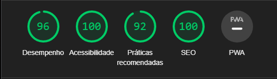

# Movie Search


## Preview


## Demo

<a href='#' target="__blank">DEMO</a>

## Description

You can search movies, series or episodes by title, year or IMDb ID.

## Objectives

- [x] Capacidade de componentização de conteúdo;
- [x] Organização de código;
- [x] Layout / (UI);
- [x] Usabilidade / (UX);
- [x] Conhecimento na linguagem utilizada;
- [x] Responsividade do conteúdo

## Requirements

- [x] React + Redux;
- [x] Use UI5 Web Components for React;
- [x] Use SCSS;

## Performance

| File      | Performance | Accessibility | Best Practices | SEO |
| --------- | ----------- | ------------- | -------------- | --- |
| All files | 96          | 100           | 92             | 100 |



---

---

## Installation and execution

**Installation of dependencies**

```
yarn
```

To run in development mode

```
yarn start
```

To view stories in **StoryBook**:

```
yarn storybook
```

---

## Additional functions

- [x] Eslit + Prettier
- [x] Storybook
